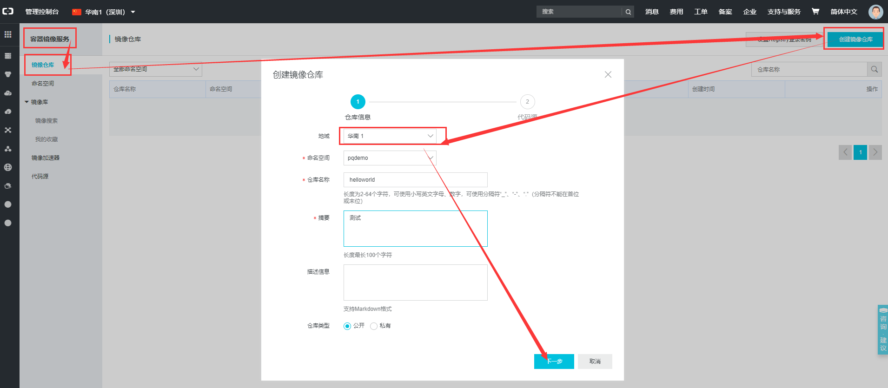
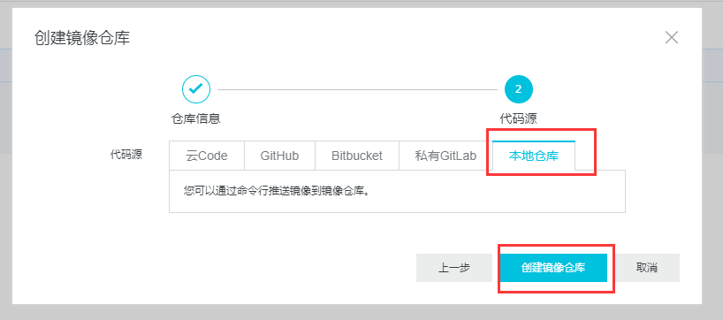
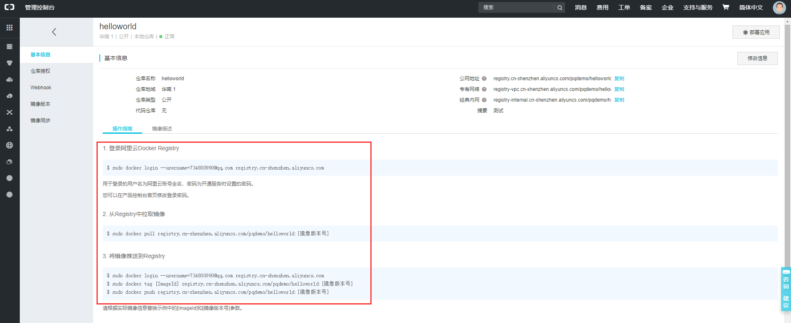

#常用命令#

1. 帮助命令：docker verison；docker info ；docker --help

2. 查看所有容器：docker ps -a

3. 查看正在运行的容器：docker ps

4. 查看上一个容器：docker ps -l

5. 查看最近的几个容器：docker ps -n (count)

6. 查看所有镜像：docker images 

7. 搜索镜像：docker search 镜像名

8. 拉取镜像：docker pull 镜像名[:tag]

9. 删除镜像：docker rmi 镜像id

10. 停止容器：docker stop 容器id

11. 删除容器：docker rm 容器id

12. 删除多个容器：docker rm -f $(docker ps -aq)           docker ps -aq | xargs docker rm

13. 重启容器：docker restart 容器id

14. 创建并启动容器：docker run [OPTIONS] 镜像id [COMMAND\][ARG...]

    | 参数(OPTIONS)  | 说明                                           |
    | -------------- | ---------------------------------------------- |
    | -d             | 以后台方式启动                                 |
    | -i             | 以交互模式运行容器，通常与-t同时使用           |
    | -t             | 为容器重新分配一个伪输入终端，通常与-i同时使用 |
    | -p 7001:6379   | 对外7001端口映射docker容器中的6379端口         |
    | --name redis01 | docker容器命名为redis01                        |
    | -P             | 随机端口映射                                   |

15. 进入交互式容器后，两种退出命令

    1.exit    2.CTRL+P，Q

16. 查看容器日志：docker logs -f -t --tail (num) 容器id   

    -t：加入时间戳              -f：跟随最新的日志打印       --tail 数字：显示最后多少条

17. 查看容器内的进程：docker top 容器id

18. 查看容器内部细节：docker inspect 容器id

19. 进入正在运行的交互式容器：docker exec -it 容器id  (bashShell:/bin/bash)          docker attach 容器id

    区别：attch直接进入容器启动命令的终端，不会启动新的进程        exec是在容器中打开新的终端，并且可以启动新的进程

20. 从容器内拷贝文件到主机上：docker cp 容器id:容器内路径  目的主机路径

21. 提交镜像：docker  commit  -m="备注信息"  -a="作者"  容器id  新镜像名[:标签名]

22. 启动容器时添加数据卷（命令）：docker run -it -v /宿主机绝对路径目录:/容器内目录  镜像名

    docker run -it -v /宿主机绝对路径目录:/容器内目录:ro  镜像名   (只读)

23. 启动容器时添加数据卷（DockerFile）：docker  build  -f  /dockerFile路径  -t  aaa/centos  **.**  (最后是一个点!!!!!)

    ```dockerfile
    FROM centos
    VOLUME ["/dataContainer1", "/dataContainer2"]
    CMD echo "hello world"
    CMD /bin/bash
    ```

24.  数据卷容器：命名的容器挂载数据卷，其他容器通过挂载这个容器实现数据共享，挂载数据卷的容器被称之为数据卷容器

    ```sh
    docker  run  -it  --name  dc01  aaa/centos 
    docker  run  -it  --name  dc02  --volumes-from  dc01  aaa/centos
    ```

#DockerFile指令#

| 命令       | 说明                                                         |
| ---------- | ------------------------------------------------------------ |
| FROM       | 基础镜像，当前新镜像是基于哪个镜像的                         |
| MAINTAINER | 镜像维护者的姓名和邮箱                                       |
| RUN        | 容器构建时需要运行的命令                                     |
| EXPOSE     | 当前容器对外暴露的端口                                       |
| WORKDIR    | 指定在容器创建后，终端默认登陆进来的目录                     |
| ENV        | 用来在构建镜像过程中设置环境变量                             |
| ADD        | 将宿主机目录下的文件拷贝进镜像并且会自动处理URL和解压tar包   |
| COPY       | 类似ADD，拷贝文件和目录到镜像中，将从构建上下文目录中的文件/目录复制一份到新的镜像内的目标路径位置 |
| VOLUME     | 容器数据卷，用于数据保存和持久化工作                         |
| CMD        | 指定一个容器启动时要执行的命令（DockerFile可以有多个CMD命令但是只有最后一个生效，CMD会被docker run之后的参数替换） |
| ENTRYPOINT | 指定一个容器启动时要执行的命令（和CMD一样，也有区别忘了就百度） |
| ONBUILD    | 当构建一个被继承的DockerFile时运行命令，父镜像在被子继承后父镜像的onbuild触发 |

#RUN、CMD与ENTRYPOINT的区别#

##主要用途

- RUN命令执行命令并创建新的镜像层，通常用于安装软件包
- CMD命令设置容器启动后默认执行的命令及其参数，但CMD设置的命令能够被`docker run`命令后面的命令行参数替换
- ENTRYPOINT配置容器启动时的执行命令（不会被忽略，一定会被执行，即使运行 `docker run`时指定了其他命令）

## Shell格式和Exec格式运行命令

我们可用两种方式指定 RUN、CMD 和 ENTRYPOINT 要运行的命令：Shell 格式和 Exec 格式：

- Shell格式：<instruction> <command>。例如：apt-get install python3
- Exec格式：<instruction> ["executable", "param1", "param2", ...]。例如： ["apt-get", "install", "python3"]

**CMD 和 ENTRYPOINT 推荐使用 Exec 格式，因为指令可读性更强，更容易理解。RUN 则两种格式都可以。**

## Run命令

RUN 指令通常用于安装应用和软件包。RUN 在当前镜像的顶部执行命令，并通过创建新的镜像层。Dockerfile 中常常包含多个 RUN 指令。下面是一个例子：

```
RUN apt-get update && apt-get install -y \  
 bzr \
 cvs \
 git \
 mercurial \
 subversion
```

> apt-get update 和 apt-get install 被放在一个 RUN 指令中执行，这样能够保证每次安装的是最新的包。如果 apt-get install 在单独的 RUN 中执行，则会使用 apt-get update 创建的镜像层，而这一层可能是很久以前缓存的。

## CMD命令

CMD 指令允许用户指定容器的默认执行的命令。**此命令会在容器启动且 docker run 没有指定其他命令时运行。**下面是一个例子：

```dockerfile
CMD echo "Hello world"
```

运行容器 docker run -it [image] 将输出：

```
Hello world
```

但当后面加上一个命令，比如 docker run -it [image] /bin/bash，CMD 会被忽略掉，命令 bash 将被执行：

```shell
root@10a32dc7d3d3:/#
```

## ENTRYPOINT命令

ENTRYPOINT 的 Exec 格式用于设置容器启动时要执行的命令及其参数，同时可通过CMD命令或者命令行参数提供额外的参数。ENTRYPOINT 中的参数始终会被使用，这是与CMD命令不同的一点。下面是一个例子：

```dockerfile
ENTRYPOINT ["/bin/echo", "Hello"]  
```

当容器通过 docker run -it [image] 启动时，输出为：

```
Hello
```

而如果通过 docker run -it [image] CloudMan 启动，则输出为：

```
Hello CloudMan
```

将Dockerfile修改为：

```dockerfile
ENTRYPOINT ["/bin/echo", "Hello"]  
CMD ["world"]
```

当容器通过 docker run -it [image] 启动时，输出为：

```
Hello world
```

而如果通过 docker run -it [image] CloudMan 启动，输出依旧为：

```
Hello CloudMan
```

> ENTRYPOINT 中的参数始终会被使用，而 CMD 的额外参数可以在容器启动时动态替换掉。

## 总结

- 使用 RUN 指令安装应用和软件包，构建镜像。
- 如果 Docker 镜像的用途是运行应用程序或服务，比如运行一个 MySQL，应该优先使用 Exec 格式的 ENTRYPOINT 指令。CMD 可为 ENTRYPOINT 提供额外的默认参数，同时可利用 docker run 命令行替换默认参数。
- 如果想为容器设置默认的启动命令，可使用 CMD 指令。用户可在 docker run 命令行中替换此默认命令。

#一个DockerFile栗子

```dockerfile
FROM centos
MAINTAINER pengqiang<aaa.qq.com>

COPY readme.txt /usr/local/my.txt

ADD apache-tomcat-8.5.30.tar.gz /usr/local/
ADD jdk-8u172-linux-x64.tar.gz /usr/local/

RUN yum -y install vim

ENV MYPATH /usr/local
WORKDIR $MYPATH
#配置JAVA环境变量与tomcat的#
ENV JAVA_HOME /usr/local/jdk1.8.0_172
ENV CLASSPATH $JAVA_HOME/lib/dt.jar:$JAVA_HOME/lib/tools.jar
ENV CATALINA_HOME /usr/local/apache-tomcat-8.5.30
ENV CATALINA_BASE /usr/local/apache-tomcat-8.5.30
ENV PATH $PATH:$JAVA_HOME/bin:$CATALINA_HOME/lib:$CATALINA_HOME/bin

EXPOSE 8080

CMD /usr/local/apache-tomcat-8.5.30/bin/startup.sh && tail -f /usr/local/apache-tomcat-8.5.30/logs/catalina.out
```


 # 镜像推送到阿里云

1. 在阿里云管理控制台添加镜像 https://home.console.aliyun.com





2. 点击镜像仓库后面的"管理"链接
   

3. 查看操作
   

4. docker登陆阿里云Docker Registry(密码是Registry登陆密码)

   ```sh
   root@peng:~# docker login --username=734800990@qq.com registry.cn-qingdao.aliyuncs.com
   ```

5. 从Registry中拉取镜像

   ```sh
   root@peng:/dockerfiles# docker pull 798672dd5e5b registry.cn-shenzhen.aliyuncs.com/pqdemo/helloworld:9.9
   ```

   > 798672dd5e5b：本地镜像id
   >
   > registry.cn-shenzhen.aliyuncs.com/pqdemo/helloworld：仓库地址
   >
   > 9.9：自己给的一个标签号

6. 将镜像推送到Registry

   ```sh
   root@peng:/dockerfiles# docker push registry.cn-shenzhen.aliyuncs.com/pqdemo/helloworld:9.9
   ```

   

7. 推送成功，在阿里云上搜索

   

